---
---
---
# 🎮 Lucho Greco - 💻 Desarrollador Full Stack 

---

## 📋 Datos Personales
- **Nombre:** Luciano Gabriel Greco
- **Fecha de Nacimiento:** 1992
- **Ubicación:** San Rafael, Mendoza, Argentina
- **Profesión:** Desarrollador Full Stack
- **Estado Civil:** Casado (Sin hijos)

---

## ✂ Resumen Profesional  
Desarrollador Full Stack con experiencia en frontend y backend, apasionado por crear soluciones innovadoras y eficientes. Manejo tecnologías como Java, Spring Boot, HTML, CSS, JavaScript y tengo experiencia en metodologías ágiles.

---

## 🎓🧾 Certificación Profesional
### *The Certified Tech Developer Full Stack* 🥇

     
    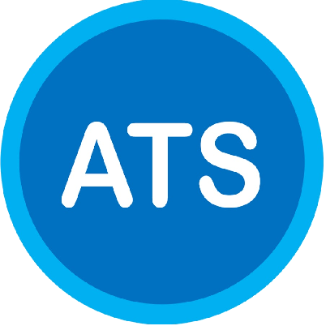 
     
     
     
    
     

> Avalado por las firmas: | Digital House | Globant | Mercado Libre

---

## [🏆 Materias Finalizadas](https://github.com/LucianoGreco/formacion-academica) 
 - [Introducción a la Informática 👌](https://github.com/LucianoGreco/formacion-academica/blob/masterIntroducci%C3%B3n_a_la_Inform%C3%A1tica/README.md) 
- [Frontend I 👌](https://github.com/LucianoGreco/formacion-academica/blob/master/Frontend_I/README.md)
- [Metodología del Trabajo 👌](https://github.com/LucianoGreco/formacion-academica/blob/master/Metodologia_del_Trabajo/README.md)
- [Base de Datos 👌](https://github.com/LucianoGreco/formacion-academica/blob/master/Base_de_datos/README.md)
- [Programación Imperativa 👌](https://github.com/LucianoGreco/formacion-academica/blob/master/Programacion_Imperativa/README.md)
- [Learning Agility 👌]()
- [Programación Orientada a Objetos 👌](https://github.com/LucianoGreco/formacion-academica/blob/master/Programacion_Orientado_a_Objetos/README.md)
- [Testing 👌](https://github.com/LucianoGreco/formacion-academica/blob/master/Testing/README.md)
- [Design Thinking 👌](https://github.com/LucianoGreco/formacion-academica/blob/master/Desing_Thinking/README.md)
- [Frontend II 👌](https://github.com/LucianoGreco/formacion-academica/blob/master/Frontend_II/README.md)
- [Infraestructura I 👌](https://github.com/LucianoGreco/formacion-academica/blob/master/Infraestructura_I/README.md)
- [UX-UI 👌](https://github.com/LucianoGreco/formacion-academica/blob/master/UX-UI/README.md)
- [Backend 👌](https://github.com/LucianoGreco/formacion-academica/blob/master/Backend/README.md)
- [Soft Skill Training - Comunicación Efectiva 👌](https://github.com/LucianoGreco/formacion-academica/tree/master/Soft_skill_training)
- [Infraestructura II 👌](https://github.com/LucianoGreco/formacion-academica/tree/master/Infraestructura_II)
- [Frontend III 👌]()
- Team Work and Collaboration 👌
- Programa de Desarrollo Profesional 👌
- Especialización Backend 📚 *En proceso...*
- Idioma Inglés 📚 *En proceso...*

---

## 👷‍♀️ Experiencia Profesional

1. **📺 FlayersTv**  
   Aplicación de transmisión de contenido vía streaming, con un amplio catálogo de películas y series.

2. **👩‍🚀 Aplicación Novva**  
   Proyecto dirigido a apasionados de la astrología, con foro y comunidad abierta para difundir eventos astrológicos y de turismo.

3. **🏐 Fulbo4u**  
   Aplicación web para alquilar y vender implementos deportivos, enfocada en artículos para el fútbol.

4. **🪓 MegaMadera**  
   Página web empresarial para la venta de melaminas, muebles, diseños y equipamiento para el hogar y oficinas.

5. **🔨 Ferreluc**  
   Negocio de ferretería, dedicada a la venta de máquinas, herramientas e insumos para el hogar, donde soy dueño. El negocio lleva 8 años en actividad. Encargado de stock, ventas, proveedores, administración y atención al cliente.

6. **💾 Otros Proyectos Chicos**  
   Participación en diversos proyectos de menor envergadura que consolidan mis habilidades en desarrollo web y gestión de aplicaciones.

---

## 📚 Educación
Certificación en Desarrollo Full Stack, Universidad XYZ  
Junio 2023

---

## 🧪🔬 Habilidades Técnicas

- **Frontend:** HTML, CSS, JavaScript, Figma  
- **Backend:** Java, Spring Boot, Hibernate  
- **Bases de Datos:** MySQL, NoSQL  
- **Metodologías:** Scrum, Kanban  
- **DevOps:** Docker, Git, GitHub  

---

## 🔧🔩 Tecnologías y Herramientas 

    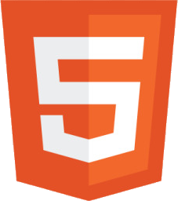 
    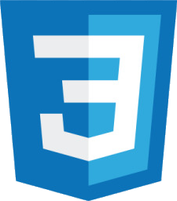 
    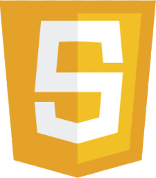 
    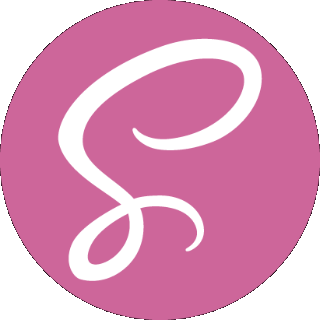 
    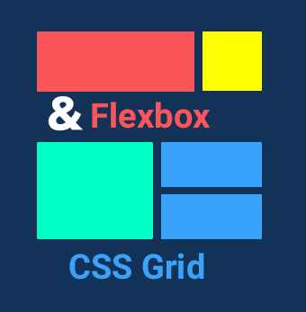 
    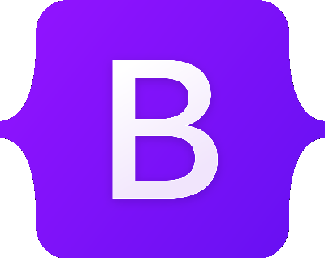 
    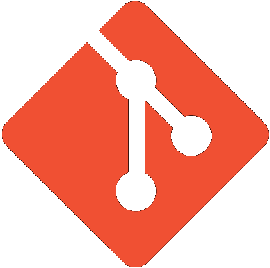 
     
    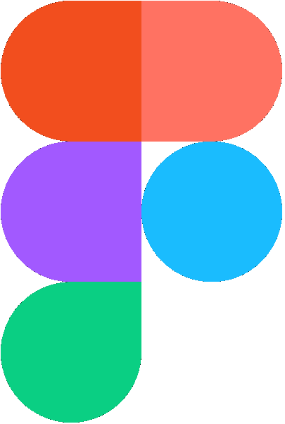 
    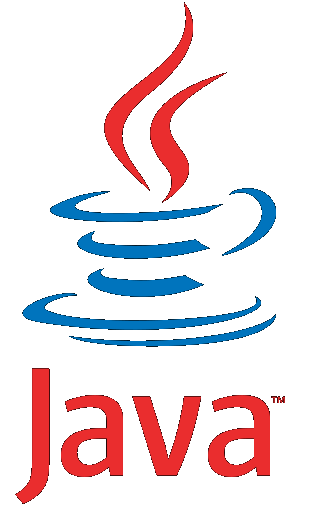 
    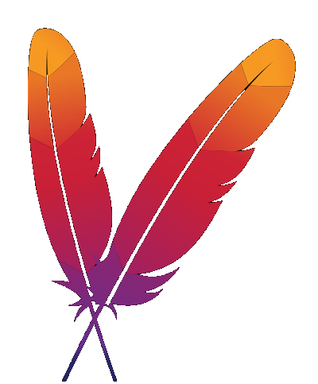 
    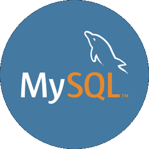 
    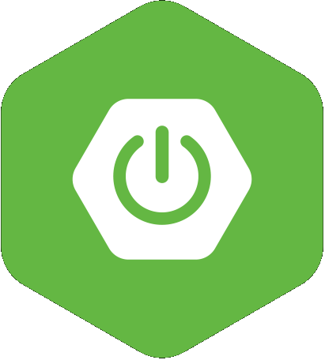 
     
     
    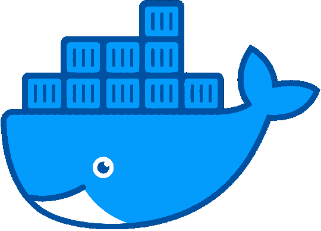 
    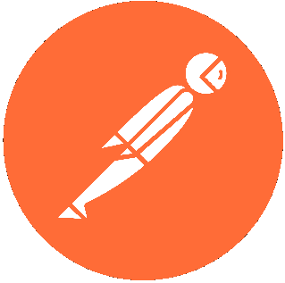 
    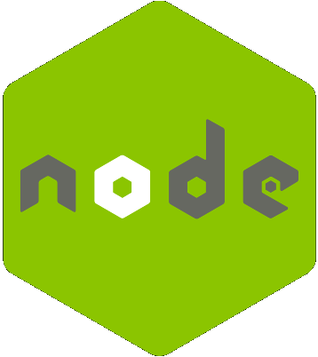 
     
    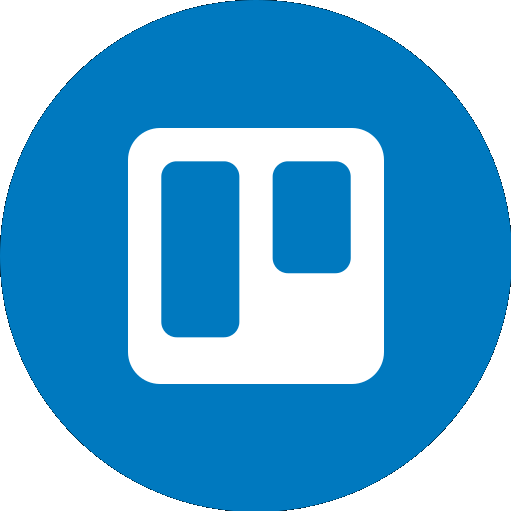 
    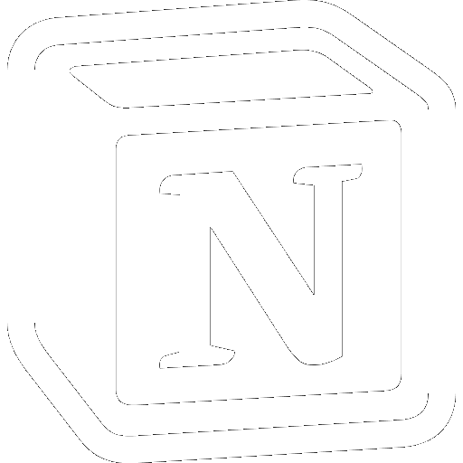 
     
    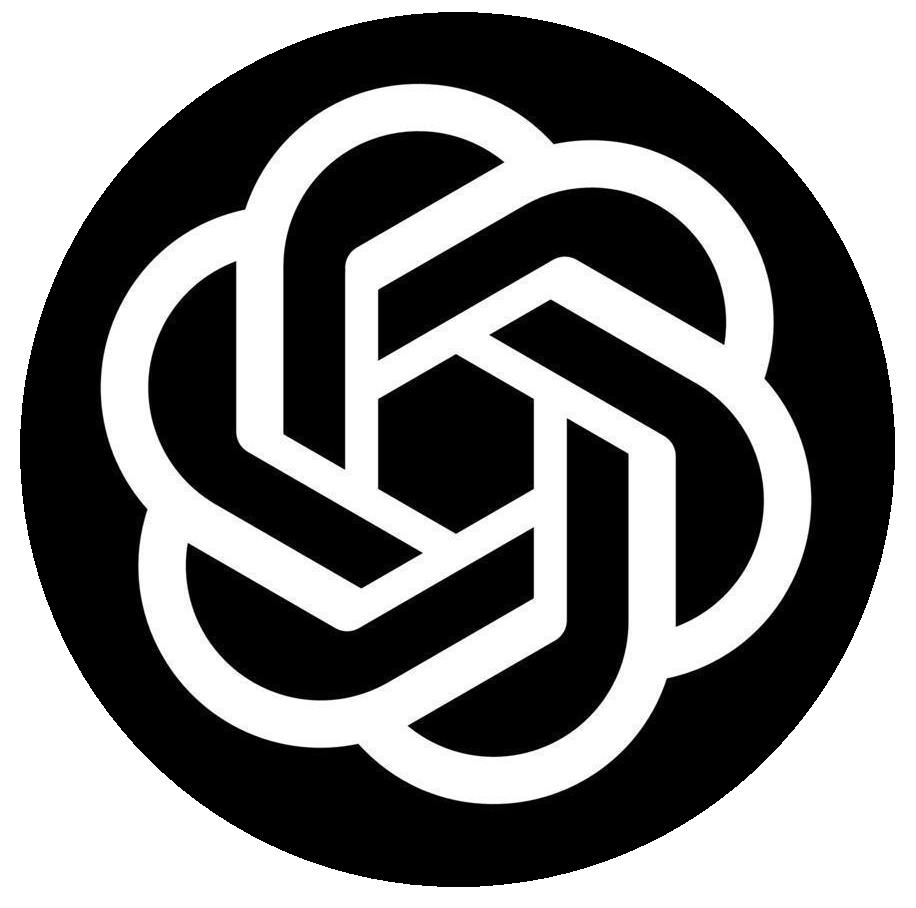 

---

## 🥇🥉 Certificaciones Adicionales

    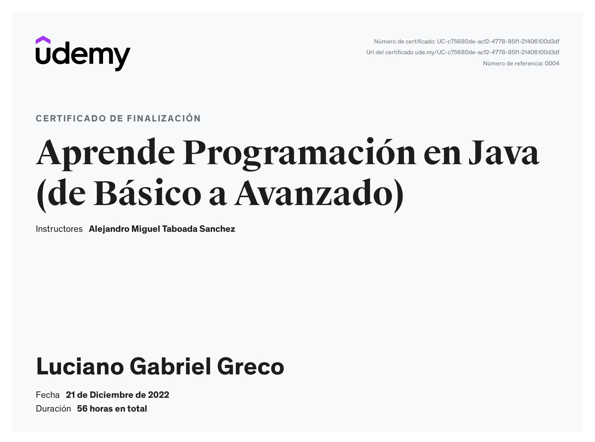
    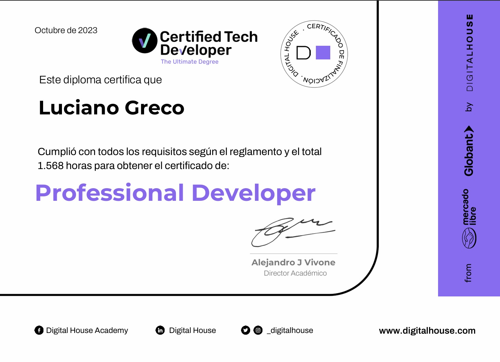
    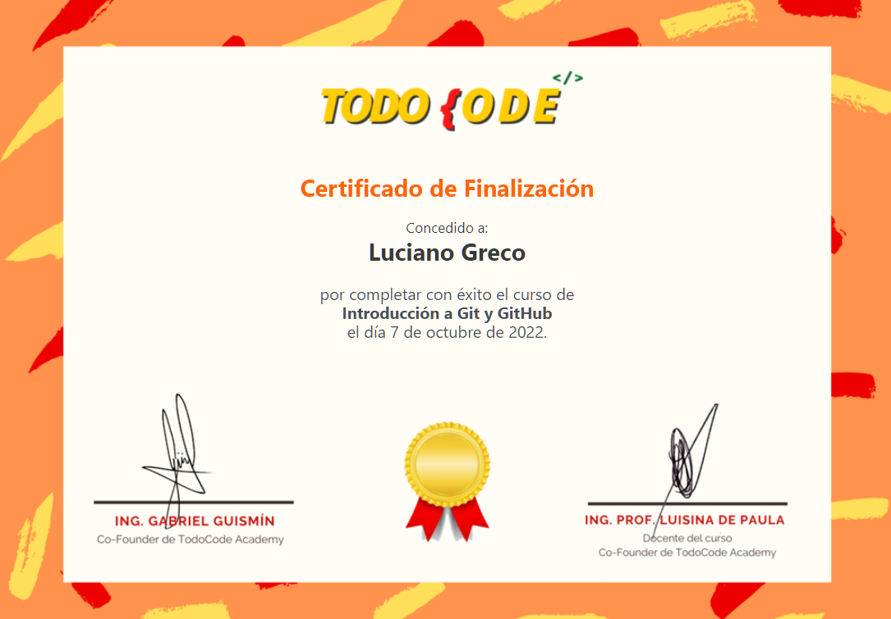

---

## 📲📞 | [Contacto](https://wa.me/5492604331727) |
**Luciano Gabriel Greco**  
**Full Stack Developer**  
[LinkedIn](https://www.linkedin.com/in/luchogrecodevelopers) | [Formacion](https://github.com/LucianoGreco/formacion-academica) | [GitHub](https://github.com/LucianoGreco) |
[Gmail](grecolucianogabriel@gmailcom)

---

## 👅 Idiomas  
- Español: Nativo  
- Inglés: 1 año (2024)
